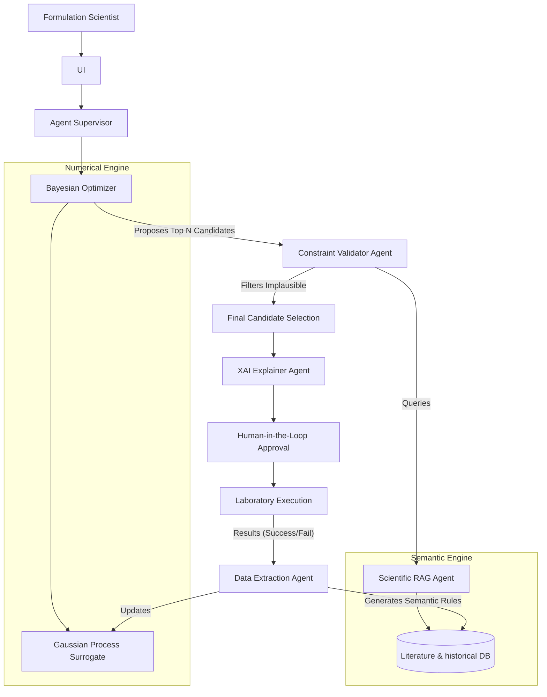

# Comprehensive Research Analysis & Proposal: Agentic Pharmaceutical Formulation Optimization

**Prepared by:** Antigravity (World-Class Research Scientist & AI/ML Architect)
**Domain:** AI/ML in Pharmaceutical Formulation, Autonomous Laboratories, and Agentic AI

---

## PART 1 — RESEARCH DOMAIN DECOMPOSITION

Your proposed concept sits at the intersection of several rapidly evolving fields. Here is how they overlap:

1. **Pharmaceutical Formulation & Stability:** The core domain. It involves selecting excipients and processing parameters to ensure drug efficacy, safety, and shelf-life (temperature-dependent stability).
2. **Machine Learning & Bayesian Optimization (BO):** The numerical engine. ML predicts properties (e.g., solubility), while BO and **Active Learning (AL)** navigate the high-dimensional design space with minimal experiments.
3. **Autonomous/Self-Driving Laboratories (SDLs):** The physical execution layer. These closed-loop systems integrate AI with robotics to physically test and iterate formulations.
4. **Agentic AI & Large Language Models (LLMs):** The reasoning layer. LLMs use **Scientific RAG** (Retrieval-Augmented Generation) and **Knowledge Graphs** to read literature, synthesize historical data, and provide semantic reasoning.
5. **Human-in-the-Loop (HITL) & Explainable AI (XAI):** The safety/validation layer. Ensures regulatory compliance and provides scientists with interpretable rationale for chosen experiments.

**The Overlap:** 
Currently, numerical optimization (BO/AL) and semantic reasoning (LLMs/Agents) are largely isolated. BO is highly sample-efficient but lacks chemical intuition and physical constraint awareness. LLMs possess broad literature-based intuition but hallucinate and lack rigorous numerical optimization capabilities. **The intersection of these two—Neuro-Symbolic Agentic Optimization—is where the frontier of research lies.**

---

## PART 2 — SYSTEMATIC LITERATURE SEARCH SUMMARY

Based on a comprehensive search of literature from 2020–2026, the field is transitioning from predictive modeling to generative and autonomous systems:

- **General ML in Formulation:** Extensive recent reviews (Sharma & Singh, 2026; Sartaj et al., 2026; Zhao et al., 2026) highlight the shift from empirical trial-and-error to data-driven strategies for predicting solubility, stability, and release profiles.
- **Bayesian Optimization & AL:** Deeply established for multi-objective optimization in complex spaces (e.g., lipid nanoparticles). BO drastically reduces required experiments (e.g., from 25+ to ~10).
- **Autonomous Labs (SDLs):** Platforms like RAISE, A-Lab, and NIST's Autonomous Formulation Lab are operational, focusing on closed-loop synthesis and material discovery.
- **LLMs & Agents:** Emerging frameworks like *PharmAgents*, *DrugAgent*, and *FormuLLA* use LLMs for ideation and literature mining. However, they struggle with physical processability and hallucination.
- **Scientific RAG:** Advanced frameworks (e.g., QA-RAG) are being developed for regulatory compliance, but standard RAG struggles with temporal context and contradictory scientific claims.

---

## PART 3 — EXISTING-SYSTEM MATRIX

| Paper / System | Year | Authors / Inst. | Pharma Problem | Formulation Type | Optimization Method | AL / BO? | SDL? | LLM / Agent? | RAG / KG? | Failed Exp Used? | Main Limitation |
| :--- | :--- | :--- | :--- | :--- | :--- | :--- | :--- | :--- | :--- | :--- | :--- |
| **A-Lab** | 2023 | Ceder et al. (UCB) | Material Synthesis | Inorganic Powders | AL / Heuristics | Yes | Yes | No | No | Yes | Focuses on simple synthesis, not complex pharma formulations. |
| **RAISE** | 2024 | RSC / NIST | Surface Wettability | Liquid Coatings | Bayesian Optimization | Yes | Yes | No | No | Yes | Strictly numerical; lacks chemical reasoning or literature grounding. |
| **FormuLLA** | 2024 | Various | 3D Printing | Solid Dosage | LLM Prompting | No | No | Yes | No | No | Hallucinates formulations that are physically impossible to manufacture. |
| **PharmAgents** | 2025 | Emerging | Drug Discovery | Varies | Multi-Agent Chaining | No | No | Yes | Yes | No | Focuses on virtual discovery; lacks a numerical active learning loop for lab execution. |
| **QA-RAG** | 2025 | SKKU | Regulatory CMC | Varies | None | No | No | Yes | Yes | No | Focuses purely on documentation, not experimental optimization. |
| **Smart Formulation** | 2026 | Various | BUD / Stability | Liquids / Biologics | Deep Learning | No | No | No | No | Yes | Predictive only; does not actively propose new experiments. |

---

## PART 4 — WHAT HAS ALREADY BEEN DONE

For your proposed components:

- **A. Already well established:** ML for predicting formulation properties; Bayesian optimization for active experiment selection; Using historical successful experiments.
- **B. Existing but limited:** Autonomous laboratories (exist for materials, emerging for pharma); RAG for scientific literature (struggles with complex contradictions).
- **C. Emerging research:** Multi-agent systems for drug discovery (PharmAgents); LLMs for formulation ideation.
- **D. Very little research:** Combining LLM reasoning with numerical Bayesian Optimization; Explicitly learning from failed experiments using semantic agents (BO uses numbers, but agents ignore the *reasons* for failure).
- **E. Potentially unexplored:** **Grounded Agentic Bayesian Optimization.** Specifically, using an LLM agent to validate BO-proposed candidates against physical/manufacturing constraints via RAG *before* laboratory execution.

---

## PART 5 — RESEARCH GAPS

1. **The Semantic-Numerical Gap (Overall Potential: 9/10)**
   - *Existing:* BO proposes mathematically optimal experiments; LLMs propose semantically logical formulations.
   - *Limitation:* BO lacks physical intuition (may propose unmixable ratios). LLMs lack numerical rigor (cannot optimize continuous variables efficiently).
   - *Proposed Solution:* A hybrid architecture where BO proposes candidates and an LLM/RAG agent acts as a "Constraint Validator" to filter out physically implausible formulations before lab testing.

2. **Processability Blindspot in LLMs (Overall Potential: 8/10)**
   - *Existing:* LLMs suggest novel excipient combinations.
   - *Limitation:* They do not account for manufacturing constraints (e.g., powder flowability, compression physics).
   - *Proposed Solution:* RAG grounded specifically in process engineering and historical failure logs.

3. **Temporal & Contradictory RAG in Pharma (Overall Potential: 7/10)**
   - *Existing:* Standard RAG retrieves top-K documents.
   - *Limitation:* Fails to distinguish between outdated stability protocols and current regulations, or resolving contradictory academic claims.

4. **Explainable Active Learning (Overall Potential: 8/10)**
   - *Existing:* AL selects the next experiment based on mathematical uncertainty.
   - *Limitation:* The scientist does not know *why* the experiment was chosen chemically.
   - *Proposed Solution:* An LLM agent that interprets the BO acquisition function and explains the chemical rationale to the HITL.

*(Other identified gaps include: Dynamic Temperature Co-Optimization, Semantic Failure Analysis, Cost-Constrained Multi-Objective AL, LLM-driven Feature Engineering for BO, etc.)*

---

## PART 6 — FOCUS ON YOUR PARTICULAR IDEA

**A. Hierarchical agent for formulation research:** *Engineering.* LangGraph makes this easy. Not independently novel.
**B. Scientific-RAG formulation generation:** *Partially Addressed.* Existing systems do this. Needs a specific twist (e.g., processability focus) to be novel.
**C. Existing formulation improvement:** *Well established* via numerical methods.
**D. Stability-aware formulation optimization:** *Well established.*
**E. Joint optimization of composition and temperature:** *Emerging.* BO does this well, but agentic involvement is missing.
**F. Learning from failed experiments:** *Partially Addressed.* Numerical models do this; LLMs do not. Bridging this is novel.
**G. Uncertainty-aware active learning:** *Already done* (standard BO).
**H. Active selection of the next lab experiment:** *Already done* (SDLs).
**L. Combining LLM agents with numerical ML models:** **THIS IS THE SWEET SPOT.**
**M. Combining RAG + formulation ML + Bayesian optimization:** **HIGHLY NOVEL.**

---

## PART 7 — ENGINEERING VS. RESEARCH NOVELTY

**MERE ENGINEERING (Do not claim as research):**
- Building a UI, FastAPI, Authentication, RBAC.
- Using LangChain, LangGraph, PostgreSQL, FAISS.
- Connecting an LLM to a database.
- Orchestrating a Supervisor agent to route tasks.

**GENUINE SCIENTIFIC CONTRIBUTIONS:**
- The *algorithm* for integrating semantic RAG constraints into a continuous Bayesian optimization acquisition function.
- A novel methodology for extracting manufacturing constraints from historical failed experiments to prune an active learning search space.
- Demonstrating quantitatively that a hybrid (LLM + BO) system converges to an optimal formulation in fewer experiments than BO alone.

---

## PART 8 — STRONGEST RESEARCH DIRECTIONS

### Direction 1: Constraint-Grounded Agentic Bayesian Optimization (Strongest)
- **Problem:** Numerical active learning often proposes chemically impossible formulations, wasting lab resources.
- **Contribution:** An LLM agent that evaluates BO acquisition proposals against RAG-derived processability constraints before lab execution.

### Direction 2: Semantic Failure Analysis for Active Learning
- **Problem:** "Failed" experiments are just numerical data points to BO, but contain rich chemical insights.
- **Contribution:** An agent that translates failed numerical experiments into semantic rules to dynamically update the RAG constraint database.

### Direction 3: Explainable Acquisition Functions in Human-in-the-Loop Labs
- **Problem:** Scientists reject BO proposals because they cannot understand the mathematical rationale.
- **Contribution:** An LLM that translates Gaussian Process uncertainty and expected improvement into chemical hypotheses for human approval.

---

## PART 9 & 10 & 11 — EXPERIMENTAL DESIGN (For Direction 1)

**Research Question (RQ1):** Does integrating LLM-based physical constraint validation into a Bayesian Optimization loop reduce the number of failed laboratory experiments required to achieve target formulation stability?

**Hypotheses:**
- **H0:** The hybrid Neuro-Symbolic Agentic system requires the same number of experiments to converge as standard Bayesian Optimization.
- **H1:** The hybrid system requires significantly fewer experiments to converge because it semantically prunes physically implausible candidates from the search space.

**Baselines:**
1. Random Search (Naive baseline)
2. Pure LLM/RAG Prompting (Semantic only)
3. Standard Bayesian Optimization (Numerical only)
4. **Proposed:** Grounded Agentic BO (Numerical + Semantic)

**Metrics:**
- Total experiments to reach target stability.
- Percentage of proposed experiments that fail physical processability (e.g., phase separation before stability testing).
- Prediction Error (RMSE of stability prediction).

---

## PART 12 — FINAL RESEARCH ARCHITECTURE

---

## PART 13 — SECURITY AND AGENT SAFETY

**Engineering Safeguards:**
- RBAC, Audit logs, Input/Output guardrails, Least-privilege tool execution.

**Research Safety Questions:**
- *Retrieval Poisoning:* Can malicious/erroneous literature injected into the RAG database steer the AL model to synthesize unsafe compounds?
- *Hallucination vs. Innovation:* How do we mathematically bound an LLM's hallucination so it doesn't falsely reject a valid, highly-novel BO proposal? (This is a valid sub-research question).

---

## PART 14 — DATA REQUIREMENTS

You cannot pretend synthetic data is real laboratory data. 
**To build a defensible benchmark:**
1. **Public Data:** Use datasets like the *Open Reaction Database (ORD)* or USPTO pharmaceutical formulation patents.
2. **Proxy Datasets:** Use solubility/stability datasets from MoleculeNet (e.g., ESOL) as a proxy for complex formulation stability.
3. **Simulated Sandbox:** Create a deterministic "ground truth" simulator (based on known chemical thermodynamics) that acts as the "Laboratory". Add Gaussian noise to simulate experimental error. The agents must interact with this simulator.

---

## PART 15 — FINAL RESEARCH PROPOSAL

**TITLE:** Neuro-Symbolic Active Learning: Integrating Agentic RAG Constraints into Bayesian Optimization for Pharmaceutical Formulation

**PROBLEM STATEMENT:** Traditional Bayesian Optimization for self-driving laboratories is highly sample-efficient but chemically naive, often proposing physically unviable formulations that waste physical lab resources. Conversely, LLMs possess chemical intuition but cannot mathematically optimize continuous variables. 

**RESEARCH GAP:** There is currently no framework that integrates unstructured semantic reasoning (LLM/RAG) as a dynamic constraint layer over continuous numerical active learning (BO) in pharmaceutical formulation.

**NOVEL CONTRIBUTION:** A hybrid agentic architecture where a Gaussian Process proposes candidates, and an LLM explicitly prunes the acquisition space using RAG-derived physical constraints and historical failure semantic analysis.

**METHODOLOGY:** 
We will construct a simulated closed-loop laboratory environment using a thermodynamic proxy model for formulation stability. We will benchmark standard BO against our Neuro-Symbolic architecture. The LLM agent will evaluate the top $k$ BO proposals by querying a RAG database of pharmaceutical excipient incompatibilities, rejecting candidates that violate physical chemistry heuristics before they are "executed."

**EXPECTED RESULTS:** We expect the proposed system to converge on the optimal formulation with a comparable number of iterations to BO, but with a drastically lower rate of "catastrophic" physical failures (e.g., total insolubility, phase separation) during the laboratory execution step.

**PUBLICATION POTENTIAL:** High. Targets top-tier ML/Chemistry venues (e.g., *Nature Machine Intelligence*, *Digital Discovery*, *NeurIPS AI for Science*).

---
**FINAL VERDICT ON YOUR IDEA:**
Your idea is excellent, but initially too broad and heavily conflated with software engineering. By narrowing the focus to **solving the chemical naivety of Bayesian Optimization using LLM Agents**, you transition from building a "cool piece of software" to conducting **genuine, defensible AI/Science research.**
